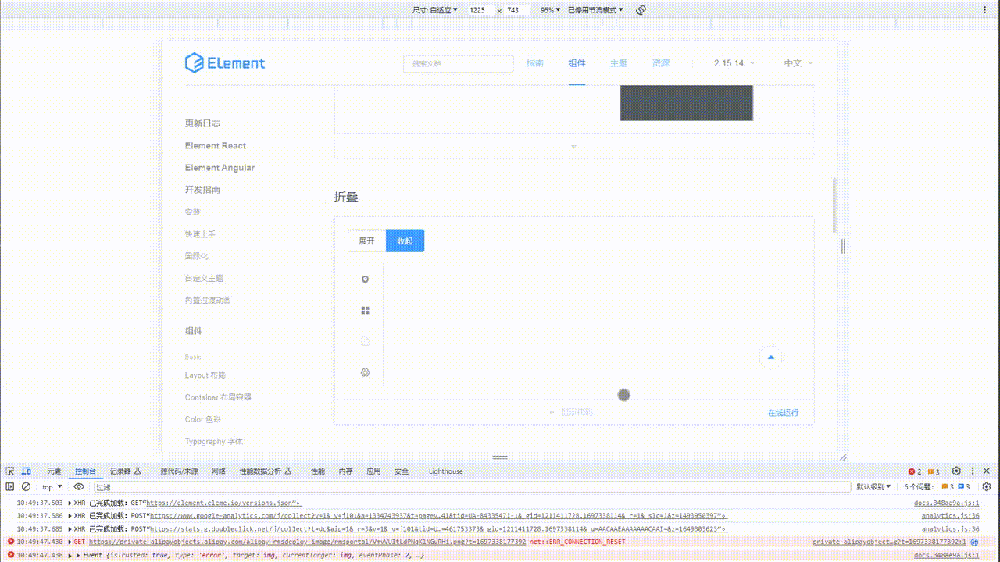
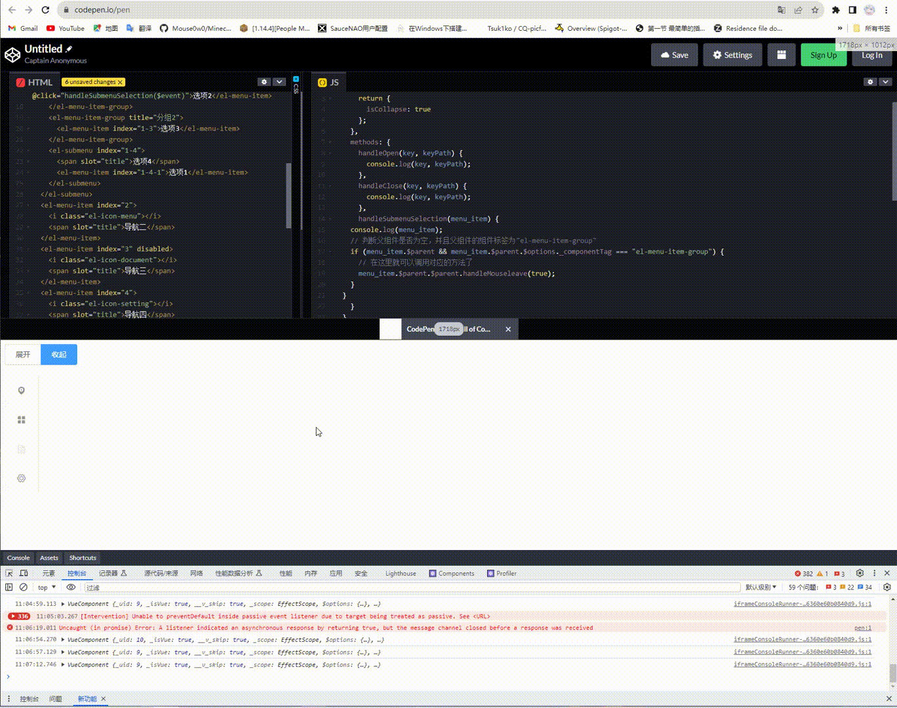

### Element-UI 2.X垂直导航在触摸屏设备中的问题

1. 问题复现如下图



2. 推测原因：

   1. 折叠后的子导航触发方式为hover（鼠标悬浮）方式
   2. 垂直导航不支持将触发方式改为click（鼠标点击）
   3. 触摸屏设备并没有鼠标相关事件

   对于网页来说，你的"鼠标"依然在那里，从而导致子导航再次显示出来。

3. 解决方案：

   1. 在每个子导航的"el-menu-item"标签中添加一个点击事件

      ```vue
      ... 其他代码
      <el-menu-item-group>
        <span slot="title">分组一</span>
        <el-menu-item index="1-1" @click="handleSubmenuSelection($event)">选项1</el-menu-item>
        <el-menu-item index="1-2" @click="handleSubmenuSelection($event)">选项2</el-menu-item>
      </el-menu-item-group>
      ... 其他代码
      <script>
      ... 其他代码
        handleSubmenuSelection(menu_item) {
          console.log(menu_item);
          // 判断父组件是否为空，并且父组件的组件标签为"el-menu-item-group"
          if (menu_item.$parent && menu_item.$parent.$options._componentTag === "el-menu-item-group") {
            // 在这里就可以调用对应的方法了
            menu_item.$parent.$parent.handleMouseleave(true);
          }
        },
      ... 其他代码
      </script>
      ```

      

4. 效果：

